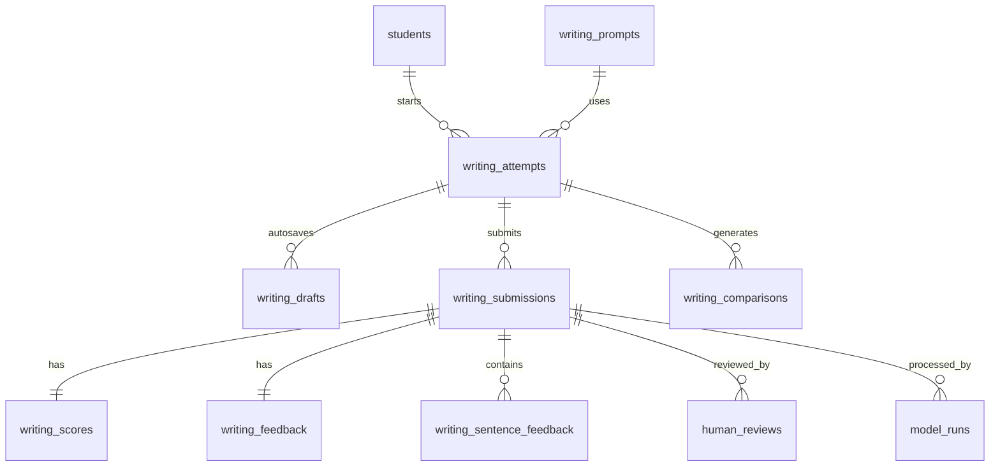

# PET Writing API + Data Design v0.1

## 1. Document Status

- Version: `v0.1`
- Date: `2026-04-23`
- Status: `Draft`
- Related PRD: `/Users/xzhan/vibcoding/EnglishTest/docs/PET-Writing-PRD-v0.1.md`

## 2. Purpose

This document translates the PET Writing PRD into:

- API contracts for frontend and backend collaboration
- a durable domain model for submissions, scoring, and feedback
- a database design that supports the Writing MVP now and other exam skills later

The design favors:

- a fast MVP
- async scoring
- auditability for ML and LLM outputs
- future extension to Reading, Listening, and Speaking

## 3. Architecture Assumptions

### MVP Architecture

- frontend web app for student interactions
- backend API service
- async scoring worker
- relational database, recommended: `PostgreSQL`
- object storage for large artifacts if needed later

### Design Principle

The system should treat writing evaluation as a pipeline:

`draft -> submit -> score -> explain -> rewrite -> compare`

Scoring and feedback generation should run asynchronously so the platform can:

- retry failed steps safely
- track status clearly
- separate structured scoring from LLM explanation

## 4. High-Level Domain Model

### Core Entities

- `student`
- `writing_prompt`
- `writing_attempt`
- `writing_submission`
- `writing_score`
- `writing_feedback`
- `writing_sentence_feedback`
- `writing_comparison`
- `human_review`
- `model_run`

### Why This Shape

- one `attempt` represents one student working on one prompt
- one attempt can contain multiple `submissions`, such as `draft 1` and `draft 2`
- each submission gets one scoring result and one feedback result
- comparisons happen between two submissions inside the same attempt

## 5. Lifecycle and Status Model

### Attempt Status

- `drafting`
- `submitted`
- `scoring`
- `feedback_ready`
- `rewrite_in_progress`
- `completed`
- `review_required`
- `failed`

### Submission Status

- `draft`
- `submitted`
- `processing`
- `scored`
- `feedback_generated`
- `comparison_generated`
- `failed`

### Review Status

- `not_required`
- `required`
- `reviewed`
- `queued`
- `in_review`

## 6. End-to-End Flow

1. Student requests a writing prompt.
2. Frontend creates a `writing_attempt`.
3. Student types into the editor and auto-saves a `draft`.
4. Student submits the first draft.
5. Backend creates a `writing_submission` and queues scoring.
6. Worker extracts structured features and generates dimension scores.
7. Worker calls LLM using grounded scoring evidence.
8. Backend stores scores, feedback, and sentence suggestions.
9. If the scorer marks the submission as low-confidence, the attempt moves to `review_required`.
10. Internal reviewers fetch pending items from the review queue and confirm or override the score.
11. Frontend polls or refreshes until the report is ready for student use.
12. Student starts a rewrite for the same attempt.
13. Student submits draft two.
14. System repeats scoring, then generates a comparison summary.

## 7. API Design Principles

- use REST-style JSON APIs
- keep student-facing reads separate from internal calibration writes
- use async jobs for submission scoring
- return stable identifiers early so frontend can poll
- preserve model outputs for audit and later evaluation

## 8. API Surface

Base path recommendation:

`/api/v1`

### 8.1 Prompt APIs

#### `GET /api/v1/writing/prompts`

Purpose:

- list available PET writing prompts for the current student

Query params:

- `task_type` optional, values such as `email`, `article`
- `limit` optional

Response:

```json
{
  "items": [
    {
      "prompt_id": "wp_pet_email_001",
      "task_type": "email",
      "title": "Write an email to your English friend",
      "instructions": "You have received an email from your English friend Sam...",
      "target_word_count_min": 100,
      "target_word_count_max": 140,
      "recommended_time_sec": 1200
    }
  ]
}
```

#### `GET /api/v1/writing/prompts/{prompt_id}`

Purpose:

- return full prompt details

### 8.2 Pre-score and Attempt APIs

#### `POST /api/v1/writing/prescore`

Purpose:

- return a stateless preview score before the student creates or submits an attempt

Request:

```json
{
  "prompt_id": "wp_pet_email_001",
  "text": "Dear Sam, I joined the music club...",
  "time_spent_sec": 540,
  "word_count_client": 112
}
```

Response:

```json
{
  "prompt": {
    "prompt_id": "wp_pet_email_001",
    "task_type": "email",
    "title": "Write an email to your English friend"
  },
  "text_stats": {
    "word_count": 112,
    "paragraph_count": 3,
    "time_spent_sec": 540
  },
  "scores": {
    "overall": 14.0,
    "readiness": "borderline",
    "confidence": 0.81,
    "dimensions": {
      "task_achievement": 4.0,
      "organization_coherence": 3.0,
      "grammar_control": 3.0,
      "lexical_range_accuracy": 4.0
    },
    "dimension_confidence": {
      "task_achievement": 0.86,
      "organization_coherence": 0.79,
      "grammar_control": 0.77,
      "lexical_range_accuracy": 0.75
    }
  },
  "review": {
    "needs_review": false,
    "review_status": "not_required",
    "review_reason_codes": []
  },
  "signals": {
    "word_count": 112,
    "task_coverage": 1.0,
    "grammar_error_rate": 0.08
  },
  "feedback_preview": {
    "priority_issues": [
      "Fix grammar errors in tense, articles, or verb forms before rewriting."
    ],
    "rewrite_task": {
      "title": "Rewrite for better cohesion",
      "instruction": "Rewrite the essay in 100-140 words. Use clearer paragraphing and add linking words between ideas."
    }
  },
  "persisted": false
}
```

Notes:

- this route should stay deterministic and low-latency
- it should not create an attempt, submission, or model-run record in storage
- it is intended for draft preview and student guidance, not official score persistence

#### `POST /api/v1/writing/attempts`

Purpose:

- create a writing attempt before the student starts typing

Request:

```json
{
  "student_id": "stu_001",
  "prompt_id": "wp_pet_email_001"
}
```

Response:

```json
{
  "attempt_id": "att_001",
  "status": "drafting",
  "prompt_id": "wp_pet_email_001",
  "draft_number": 1,
  "created_at": "2026-04-23T08:00:00Z"
}
```

#### `GET /api/v1/writing/attempts/{attempt_id}`

Purpose:

- return attempt summary, latest status, and latest submission ids

### 8.3 Draft Autosave API

#### `PUT /api/v1/writing/attempts/{attempt_id}/draft`

Purpose:

- save the in-progress draft text without triggering scoring

Request:

```json
{
  "draft_number": 1,
  "text": "Dear Sam, I am very happy to write to you...",
  "time_spent_sec": 320
}
```

Response:

```json
{
  "attempt_id": "att_001",
  "draft_number": 1,
  "saved_at": "2026-04-23T08:05:22Z",
  "word_count": 97,
  "status": "draft"
}
```

### 8.4 Submission APIs

#### `POST /api/v1/writing/attempts/{attempt_id}/submissions`

Purpose:

- submit a draft for scoring

Request:

```json
{
  "draft_number": 1,
  "text": "Dear Sam, I am very happy to write to you...",
  "time_spent_sec": 1120,
  "word_count_client": 128
}
```

Response:

```json
{
  "submission_id": "sub_001",
  "attempt_id": "att_001",
  "draft_number": 1,
  "status": "processing",
  "queue_status": "queued",
  "poll_url": "/api/v1/writing/submissions/sub_001"
}
```

#### `GET /api/v1/writing/submissions/{submission_id}`

Purpose:

- return processing state and minimal summary

Response when processing:

```json
{
  "submission_id": "sub_001",
  "attempt_id": "att_001",
  "draft_number": 1,
  "status": "processing",
  "pipeline_stage": "scoring",
  "review_status": "not_required"
}
```

Response when complete:

```json
{
  "submission_id": "sub_001",
  "attempt_id": "att_001",
  "draft_number": 1,
  "status": "feedback_generated",
  "review_status": "not_required",
  "report_ready": true
}
```

#### `GET /api/v1/writing/submissions/{submission_id}/report`

Purpose:

- return the full student-facing result payload

Response:

```json
{
  "submission_id": "sub_001",
  "attempt_id": "att_001",
  "draft_number": 1,
  "prompt": {
    "prompt_id": "wp_pet_email_001",
    "task_type": "email",
    "title": "Write an email to your English friend"
  },
  "text_stats": {
    "word_count": 128,
    "paragraph_count": 3,
    "time_spent_sec": 1120
  },
  "scores": {
    "overall": {
      "score": 14,
      "max_score": 20,
      "readiness": "borderline",
      "confidence": 0.81
    },
    "dimensions": {
      "task_achievement": { "score": 4, "max_score": 5, "confidence": 0.86 },
      "organization_coherence": { "score": 3, "max_score": 5, "confidence": 0.79 },
      "grammar_control": { "score": 3, "max_score": 5, "confidence": 0.77 },
      "lexical_range_accuracy": { "score": 4, "max_score": 5, "confidence": 0.75 }
    }
  },
  "feedback": {
    "strengths": [
      "You covered most of the required content points.",
      "Your vocabulary is more varied than a basic template response."
    ],
    "priority_issues": [
      "The second and third paragraphs do not connect smoothly.",
      "There are several tense and article errors.",
      "The ending should respond more clearly to the writing purpose."
    ],
    "sentence_suggestions": [
      {
        "issue_type": "grammar",
        "original": "I very enjoy to join the club.",
        "suggestion": "I really enjoy taking part in the club.",
        "reason": "This version is grammatically correct and sounds more natural."
      }
    ],
    "rewrite_task": {
      "title": "Rewrite for better cohesion",
      "instruction": "Rewrite the essay in 120-140 words. Keep the same idea, improve paragraph transitions, and correct tense and article errors."
    }
  },
  "review": {
    "needs_review": false,
    "review_status": "not_required",
    "review_reason_codes": []
  }
}
```

### 8.5 Rewrite APIs

#### `POST /api/v1/writing/attempts/{attempt_id}/rewrite`

Purpose:

- mark the attempt as entering rewrite mode and return rewrite instructions

Response:

```json
{
  "attempt_id": "att_001",
  "status": "rewrite_in_progress",
  "next_draft_number": 2,
  "rewrite_task": {
    "title": "Rewrite for better cohesion",
    "instruction": "Rewrite the essay in 120-140 words. Keep the same idea, improve paragraph transitions, and correct tense and article errors."
  }
}
```

### 8.6 Comparison APIs

#### `GET /api/v1/writing/attempts/{attempt_id}/comparison`

Purpose:

- return comparison for draft one and the latest rewrite

Response:

```json
{
  "attempt_id": "att_001",
  "base_submission_id": "sub_001",
  "compare_submission_id": "sub_002",
  "score_delta": {
    "overall": 2,
    "task_achievement": 0,
    "organization_coherence": 1,
    "grammar_control": 1,
    "lexical_range_accuracy": 0
  },
  "summary": {
    "improved": [
      "Paragraph transitions are clearer than in the first draft.",
      "There are fewer tense errors."
    ],
    "still_needs_work": [
      "The ending can respond more directly to the writing purpose."
    ]
  }
}
```

### 8.7 History APIs

#### `GET /api/v1/students/{student_id}/writing/history`

Purpose:

- return writing attempts and score trend for one student

Query params:

- `limit`
- `cursor`

### 8.8 Internal Review APIs

#### `GET /api/v1/internal/writing/reviews/queue`

Purpose:

- return pending review items for internal teacher or QA workflows

Response:

```json
{
  "items": [
    {
      "attempt_id": "att_001",
      "submission_id": "sub_001",
      "student_id": "stu_001",
      "draft_number": 1,
      "submitted_at": "2026-04-24T08:00:00Z",
      "review_status": "required",
      "status": "review_required",
      "prompt": {
        "prompt_id": "wp_pet_email_001",
        "task_type": "email",
        "title": "Write an email to your English friend"
      },
      "scores": {
        "overall": 9.5,
        "readiness": "below_target"
      },
      "review_reason_codes": [
        "below_target_word_count",
        "low_task_coverage"
      ]
    }
  ],
  "next_cursor": null
}
```

#### `POST /api/v1/internal/writing/reviews`

Purpose:

- store a human review for score calibration or QA and promote the attempt out of `review_required`

Request:

```json
{
  "submission_id": "sub_001",
  "reviewer_id": "teacher_001",
  "scores": {
    "task_achievement": 4,
    "organization_coherence": 3,
    "grammar_control": 3,
    "lexical_range_accuracy": 4,
    "overall": 14
  },
  "comment": "The score is fair. Main weakness remains cohesion."
}
```

Behavior notes:

- when review is submitted, the reviewed scores become the official report scores
- `review.needs_review` becomes `false`
- `review.review_status` becomes `reviewed`
- for draft 1, the attempt moves back to `feedback_ready`
- for draft 2+, the attempt moves to `completed`

## 9. Suggested Error Model

Common API error shape:

```json
{
  "error": {
    "code": "SUBMISSION_TOO_SHORT",
    "message": "Essay is below the minimum recommended word count.",
    "details": {
      "min_word_count": 100,
      "current_word_count": 61
    }
  }
}
```

Recommended error codes:

- `PROMPT_NOT_FOUND`
- `ATTEMPT_NOT_FOUND`
- `SUBMISSION_NOT_FOUND`
- `SUBMISSION_TOO_SHORT`
- `INVALID_DRAFT_NUMBER`
- `SCORING_PIPELINE_FAILED`
- `REPORT_NOT_READY`
- `UNAUTHORIZED`

## 10. Database Design

Recommended database:

- `PostgreSQL 15+`

Use:

- normalized relational tables for core entities
- `jsonb` for flexible model evidence and LLM payloads

## 11. Table Design

### 11.1 `students`

Purpose:

- account-level identity for student-facing history and personalization

Suggested columns:

- `id` `uuid` primary key
- `external_ref` `text` nullable
- `display_name` `text`
- `grade_level` `text` nullable
- `target_exam` `text` default `PET`
- `locale` `text` default `en-US`
- `created_at` `timestamptz`
- `updated_at` `timestamptz`

### 11.2 `writing_prompts`

Purpose:

- reusable prompt bank

Suggested columns:

- `id` `uuid` primary key
- `prompt_code` `text` unique
- `task_type` `text`
- `title` `text`
- `instructions` `text`
- `source` `text` nullable
- `target_word_count_min` `integer`
- `target_word_count_max` `integer`
- `recommended_time_sec` `integer`
- `rubric_version` `text`
- `active` `boolean`
- `metadata` `jsonb`
- `created_at` `timestamptz`
- `updated_at` `timestamptz`

### 11.3 `writing_attempts`

Purpose:

- one attempt per student per chosen prompt session

Suggested columns:

- `id` `uuid` primary key
- `student_id` `uuid` references `students(id)`
- `prompt_id` `uuid` references `writing_prompts(id)`
- `status` `text`
- `current_draft_number` `integer` default `1`
- `latest_submission_id` `uuid` nullable
- `review_status` `text` default `not_required`
- `started_at` `timestamptz`
- `completed_at` `timestamptz` nullable
- `created_at` `timestamptz`
- `updated_at` `timestamptz`

Recommended indexes:

- `(student_id, created_at desc)`
- `(prompt_id, created_at desc)`
- `(status)`

### 11.4 `writing_drafts`

Purpose:

- autosaved editor state before official submission

Suggested columns:

- `id` `uuid` primary key
- `attempt_id` `uuid` references `writing_attempts(id)`
- `draft_number` `integer`
- `text_content` `text`
- `word_count` `integer`
- `time_spent_sec` `integer`
- `saved_at` `timestamptz`
- `created_at` `timestamptz`
- `updated_at` `timestamptz`

Unique constraint:

- `(attempt_id, draft_number)`

### 11.5 `writing_submissions`

Purpose:

- immutable submitted drafts that trigger scoring

Suggested columns:

- `id` `uuid` primary key
- `attempt_id` `uuid` references `writing_attempts(id)`
- `draft_number` `integer`
- `status` `text`
- `submitted_text` `text`
- `word_count` `integer`
- `paragraph_count` `integer`
- `time_spent_sec` `integer`
- `pipeline_stage` `text`
- `submitted_at` `timestamptz`
- `processed_at` `timestamptz` nullable
- `created_at` `timestamptz`
- `updated_at` `timestamptz`

Unique constraint:

- `(attempt_id, draft_number)`

Recommended indexes:

- `(attempt_id, draft_number)`
- `(status, submitted_at desc)`
- `(pipeline_stage)`

### 11.6 `writing_scores`

Purpose:

- structured scoring output

Suggested columns:

- `id` `uuid` primary key
- `submission_id` `uuid` references `writing_submissions(id)`
- `overall_score` `numeric(5,2)`
- `overall_max_score` `numeric(5,2)` default `20`
- `readiness_label` `text`
- `overall_confidence` `numeric(4,3)`
- `task_achievement_score` `numeric(5,2)`
- `organization_coherence_score` `numeric(5,2)`
- `grammar_control_score` `numeric(5,2)`
- `lexical_range_accuracy_score` `numeric(5,2)`
- `task_achievement_confidence` `numeric(4,3)`
- `organization_coherence_confidence` `numeric(4,3)`
- `grammar_control_confidence` `numeric(4,3)`
- `lexical_range_accuracy_confidence` `numeric(4,3)`
- `feature_signals` `jsonb`
- `scoring_evidence` `jsonb`
- `scored_at` `timestamptz`
- `created_at` `timestamptz`

Unique constraint:

- `(submission_id)`

### 11.7 `writing_feedback`

Purpose:

- student-facing explanation payload

Suggested columns:

- `id` `uuid` primary key
- `submission_id` `uuid` references `writing_submissions(id)`
- `strengths` `jsonb`
- `priority_issues` `jsonb`
- `rewrite_task` `jsonb`
- `report_payload` `jsonb`
- `feedback_version` `text`
- `generated_at` `timestamptz`
- `created_at` `timestamptz`

Unique constraint:

- `(submission_id)`

### 11.8 `writing_sentence_feedback`

Purpose:

- sentence-level suggestions for targeted revision

Suggested columns:

- `id` `uuid` primary key
- `submission_id` `uuid` references `writing_submissions(id)`
- `sort_order` `integer`
- `issue_type` `text`
- `original_text` `text`
- `suggested_text` `text`
- `reason` `text`
- `evidence` `jsonb`
- `created_at` `timestamptz`

Recommended indexes:

- `(submission_id, sort_order)`

### 11.9 `writing_comparisons`

Purpose:

- persist comparison between two drafts in one attempt

Suggested columns:

- `id` `uuid` primary key
- `attempt_id` `uuid` references `writing_attempts(id)`
- `base_submission_id` `uuid` references `writing_submissions(id)`
- `compare_submission_id` `uuid` references `writing_submissions(id)`
- `score_delta` `jsonb`
- `improved_points` `jsonb`
- `remaining_points` `jsonb`
- `comparison_payload` `jsonb`
- `generated_at` `timestamptz`
- `created_at` `timestamptz`

Recommended indexes:

- `(attempt_id, generated_at desc)`

### 11.10 `human_reviews`

Purpose:

- manual QA and calibration records

Suggested columns:

- `id` `uuid` primary key
- `submission_id` `uuid` references `writing_submissions(id)`
- `reviewer_id` `text`
- `review_type` `text`
- `overall_score` `numeric(5,2)`
- `dimension_scores` `jsonb`
- `comment` `text`
- `created_at` `timestamptz`

Recommended indexes:

- `(submission_id)`
- `(reviewer_id, created_at desc)`

### 11.11 `model_runs`

Purpose:

- audit ML and LLM executions

Suggested columns:

- `id` `uuid` primary key
- `submission_id` `uuid` references `writing_submissions(id)`
- `stage` `text`
- `provider` `text`
- `model_name` `text`
- `model_version` `text` nullable
- `input_payload` `jsonb`
- `output_payload` `jsonb`
- `latency_ms` `integer`
- `status` `text`
- `error_message` `text` nullable
- `created_at` `timestamptz`

Recommended indexes:

- `(submission_id, stage, created_at desc)`

## 12. PostgreSQL DDL Draft

```sql
create table students (
  id uuid primary key,
  external_ref text,
  display_name text not null,
  grade_level text,
  target_exam text not null default 'PET',
  locale text not null default 'en-US',
  created_at timestamptz not null default now(),
  updated_at timestamptz not null default now()
);

create table writing_prompts (
  id uuid primary key,
  prompt_code text not null unique,
  task_type text not null,
  title text not null,
  instructions text not null,
  source text,
  target_word_count_min integer not null,
  target_word_count_max integer not null,
  recommended_time_sec integer not null,
  rubric_version text not null,
  active boolean not null default true,
  metadata jsonb not null default '{}'::jsonb,
  created_at timestamptz not null default now(),
  updated_at timestamptz not null default now()
);

create table writing_attempts (
  id uuid primary key,
  student_id uuid not null references students(id),
  prompt_id uuid not null references writing_prompts(id),
  status text not null,
  current_draft_number integer not null default 1,
  latest_submission_id uuid,
  review_status text not null default 'not_required',
  started_at timestamptz not null default now(),
  completed_at timestamptz,
  created_at timestamptz not null default now(),
  updated_at timestamptz not null default now()
);

create table writing_drafts (
  id uuid primary key,
  attempt_id uuid not null references writing_attempts(id) on delete cascade,
  draft_number integer not null,
  text_content text not null,
  word_count integer not null,
  time_spent_sec integer not null default 0,
  saved_at timestamptz not null default now(),
  created_at timestamptz not null default now(),
  updated_at timestamptz not null default now(),
  unique (attempt_id, draft_number)
);

create table writing_submissions (
  id uuid primary key,
  attempt_id uuid not null references writing_attempts(id) on delete cascade,
  draft_number integer not null,
  status text not null,
  submitted_text text not null,
  word_count integer not null,
  paragraph_count integer not null default 1,
  time_spent_sec integer not null default 0,
  pipeline_stage text not null,
  submitted_at timestamptz not null default now(),
  processed_at timestamptz,
  created_at timestamptz not null default now(),
  updated_at timestamptz not null default now(),
  unique (attempt_id, draft_number)
);

alter table writing_attempts
  add constraint fk_writing_attempts_latest_submission
  foreign key (latest_submission_id) references writing_submissions(id);

create table writing_scores (
  id uuid primary key,
  submission_id uuid not null unique references writing_submissions(id) on delete cascade,
  overall_score numeric(5,2) not null,
  overall_max_score numeric(5,2) not null default 20,
  readiness_label text not null,
  overall_confidence numeric(4,3) not null,
  task_achievement_score numeric(5,2) not null,
  organization_coherence_score numeric(5,2) not null,
  grammar_control_score numeric(5,2) not null,
  lexical_range_accuracy_score numeric(5,2) not null,
  task_achievement_confidence numeric(4,3) not null,
  organization_coherence_confidence numeric(4,3) not null,
  grammar_control_confidence numeric(4,3) not null,
  lexical_range_accuracy_confidence numeric(4,3) not null,
  feature_signals jsonb not null default '{}'::jsonb,
  scoring_evidence jsonb not null default '{}'::jsonb,
  scored_at timestamptz not null default now(),
  created_at timestamptz not null default now()
);

create table writing_feedback (
  id uuid primary key,
  submission_id uuid not null unique references writing_submissions(id) on delete cascade,
  strengths jsonb not null default '[]'::jsonb,
  priority_issues jsonb not null default '[]'::jsonb,
  rewrite_task jsonb not null default '{}'::jsonb,
  report_payload jsonb not null default '{}'::jsonb,
  feedback_version text not null,
  generated_at timestamptz not null default now(),
  created_at timestamptz not null default now()
);

create table writing_sentence_feedback (
  id uuid primary key,
  submission_id uuid not null references writing_submissions(id) on delete cascade,
  sort_order integer not null,
  issue_type text not null,
  original_text text not null,
  suggested_text text not null,
  reason text not null,
  evidence jsonb not null default '{}'::jsonb,
  created_at timestamptz not null default now()
);

create table writing_comparisons (
  id uuid primary key,
  attempt_id uuid not null references writing_attempts(id) on delete cascade,
  base_submission_id uuid not null references writing_submissions(id),
  compare_submission_id uuid not null references writing_submissions(id),
  score_delta jsonb not null default '{}'::jsonb,
  improved_points jsonb not null default '[]'::jsonb,
  remaining_points jsonb not null default '[]'::jsonb,
  comparison_payload jsonb not null default '{}'::jsonb,
  generated_at timestamptz not null default now(),
  created_at timestamptz not null default now()
);

create table human_reviews (
  id uuid primary key,
  submission_id uuid not null references writing_submissions(id) on delete cascade,
  reviewer_id text not null,
  review_type text not null default 'calibration',
  overall_score numeric(5,2),
  dimension_scores jsonb not null default '{}'::jsonb,
  comment text,
  created_at timestamptz not null default now()
);

create table model_runs (
  id uuid primary key,
  submission_id uuid not null references writing_submissions(id) on delete cascade,
  stage text not null,
  provider text not null,
  model_name text not null,
  model_version text,
  input_payload jsonb not null default '{}'::jsonb,
  output_payload jsonb not null default '{}'::jsonb,
  latency_ms integer,
  status text not null,
  error_message text,
  created_at timestamptz not null default now()
);

create index idx_writing_attempts_student_created_at
  on writing_attempts (student_id, created_at desc);

create index idx_writing_attempts_status
  on writing_attempts (status);

create index idx_writing_submissions_status_submitted_at
  on writing_submissions (status, submitted_at desc);

create index idx_writing_submissions_attempt_draft
  on writing_submissions (attempt_id, draft_number);

create index idx_writing_sentence_feedback_submission_sort
  on writing_sentence_feedback (submission_id, sort_order);

create index idx_human_reviews_submission
  on human_reviews (submission_id);

create index idx_model_runs_submission_stage_created_at
  on model_runs (submission_id, stage, created_at desc);
```

## 13. Entity Relationships



## 14. Async Pipeline Design

Recommended stages:

1. `validate_submission`
2. `extract_text_features`
3. `predict_scores`
4. `generate_feedback`
5. `generate_sentence_feedback`
6. `generate_comparison` when draft number is `2+`
7. `finalize_report`

Suggested job payload:

```json
{
  "submission_id": "sub_001",
  "attempt_id": "att_001",
  "draft_number": 1,
  "task_type": "email"
}
```

## 15. Internal Scoring Payload Shape

This payload is not shown directly to students, but it should be stored for traceability.

```json
{
  "submission_id": "sub_001",
  "features": {
    "word_count": 128,
    "paragraph_count": 3,
    "task_coverage": 0.84,
    "grammar_error_rate": 0.09,
    "lexical_diversity": 0.63,
    "sentence_variety": 0.58,
    "off_topic_risk": 0.08
  },
  "scores": {
    "task_achievement": 4,
    "organization_coherence": 3,
    "grammar_control": 3,
    "lexical_range_accuracy": 4,
    "overall": 14
  },
  "confidence": {
    "overall": 0.81,
    "task_achievement": 0.86,
    "organization_coherence": 0.79,
    "grammar_control": 0.77,
    "lexical_range_accuracy": 0.75
  },
  "flags": [
    "ending_underdeveloped"
  ]
}
```

## 16. Security and Privacy

- student essays should be treated as protected user content
- access to one student's attempts must be restricted by auth scope
- model payload logging should avoid storing unnecessary personal data
- internal review APIs should be role-protected
- future audio and image inputs should use separate storage policies

## 17. Future-Proofing for Other Skills

This design should make later expansion easier:

- `students` can be shared across all PET modules
- `writing_prompts` can later inspire a generic `assessment_prompts` model if needed
- `model_runs` is already reusable for Reading, Listening, and Speaking
- async pipeline design can be reused for transcription and objective scoring

One likely future refactor:

- if multiple modules become active, create shared tables such as:
  - `assessment_attempts`
  - `assessment_submissions`
  - `assessment_model_runs`

For MVP, keeping Writing-specific tables is simpler and faster.

## 18. Recommended Build Order

### Phase A

- `writing_prompts`
- `writing_attempts`
- `writing_drafts`
- `writing_submissions`
- prompt APIs
- autosave API
- submission API

### Phase B

- `writing_scores`
- `writing_feedback`
- report API
- scoring worker skeleton

### Phase C

- `writing_sentence_feedback`
- `writing_comparisons`
- rewrite APIs
- comparison API

### Phase D

- `human_reviews`
- `model_runs`
- internal QA APIs

## 19. Open Questions

- should autosave keep revision history or only the latest draft state?
- should score confidence be visible to students or only used internally?
- do we need prompt difficulty metadata in MVP?
- should second-draft comparison be generated automatically or lazily on request?
- when the model is low confidence, should the student see a delayed report or a simplified report first?

## 20. Recommendation

The backend should implement the MVP around `attempt -> submission -> score -> feedback -> rewrite -> comparison`.

This structure is:

- easy for frontend to understand
- compatible with async scoring
- auditable for ML and LLM behavior
- extensible for future PET modules
