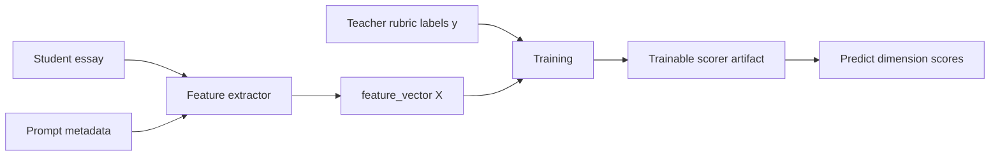

# PET Writing Feature Extraction Design

**Date:** 2026-04-29  
**Status:** Draft  
**Scope:** PET Writing first-version ML scorer input design

## 1. Goal

This document defines how one PET Writing essay is converted into machine-learning input features.

The core idea is:

```text
student essay + prompt metadata
-> feature extraction
-> numeric feature_vector
-> supervised scorer training
```

For the first version, the scorer should use interpretable numeric features instead of sending raw essay text directly into a deep model. This keeps the model easier to debug, easier to explain to teachers, and easier to improve while the amount of gold data is still small.

## 2. Why Feature Extraction Matters

An essay is human language. A first-version regression model, such as Ridge Regression, LightGBM, or CatBoost, needs numbers.

Feature extraction is the translation layer:

```text
"Dear Sam, I joined the music club because..."
-> word_count = 43
-> task_coverage = 1.0
-> grammar_error_rate = 0.0
-> lexical_diversity = 0.86
```

The model does not directly understand the essay. It learns the relationship between these numbers and teacher-reviewed rubric scores.

## 3. Position In The Supervised Learning Flow



In training:

```text
X = feature_vector
y = teacher-reviewed labels
```

Example labels:

```json
{
  "task_achievement": 5,
  "organization_coherence": 4,
  "grammar_control": 4,
  "lexical_range_accuracy": 4
}
```

The labels are not input features. They are the standard answers that the model learns to predict.

## 4. Input Data

The feature extractor needs three main inputs:

| Input | Example | Purpose |
|---|---|---|
| `prompt` | built-in prompt metadata | Defines task type, target word count, and expected content points |
| `text` | student essay text | Main source for writing-quality signals |
| `time_spent_sec` | `980` | Optional behavior signal, converted into minutes |

For training, each essay record also needs teacher labels. Those labels are used by the training step, not by feature extraction itself.

## 5. Three Output Layers

The current extractor produces three useful layers.

### 5.1 Signals

`signals` are human-readable measurements about the essay.

Examples:

- `word_count`
- `task_coverage`
- `grammar_error_rate`
- `lexical_diversity`
- `connector_density`

These are useful for reports, debugging, and model training.

### 5.2 Evidence

`evidence` stores supporting details that explain why a signal has a certain value.

Examples:

- `content_hits`
- `missing_content_points`
- `within_target_word_count`
- `repeated_words`
- `lowercase_sentence_starts`

This layer is important because scoring should be explainable to teachers and students.

### 5.3 Feature Vector

`feature_vector` is the final numeric object passed to the trainable scorer.

Every value must be numeric:

- continuous number, such as `43.0`
- ratio, such as `0.86`
- binary flag, such as `1.0` or `0.0`

This is the model's real input.

## 6. Current Feature Vector Fields

| Feature | Example Value | Chinese Meaning | Model Role |
|---|---:|---|---|
| `word_count` | `43.0` | 作文单词总数 | Measures length and task completeness risk |
| `paragraph_count` | `1.0` | 段落数量 | Measures basic organization structure |
| `task_coverage` | `1.0` | 题目要求内容点覆盖率, `1.0` means 100% | Strong signal for Task Achievement |
| `grammar_error_rate` | `0.0` | 当前规则检测到的语法错误比例 | Early signal for Grammar Control |
| `lexical_diversity` | `0.86` | 词汇多样性, 越接近 `1.0` 重复越少 | Signal for Lexical Range and Accuracy |
| `sentence_variety` | `1.0` | 句子长度变化程度 | Signal for sentence control and writing maturity |
| `off_topic_risk` | `0.0` | 跑题风险 | Negative signal for Task Achievement |
| `connectors` | `3.0` | 连接词数量 | Signal for organization and coherence |
| `connector_density` | `1.0` | 平均每句话连接词数量 | Signal for cohesion |
| `avg_sentence_length` | `14.33` | 平均句长 | Helps detect too simple or too long sentences |
| `long_sentence_ratio` | `0.0` | 长句比例 | Helps detect possible sentence-control risk |
| `within_target_word_count` | `0.0` | 是否在目标字数范围内, `1.0` yes, `0.0` no | Important PET task-format signal |
| `content_hits` | `3.0` | 命中的题目内容点数量 | Direct support for Task Achievement |
| `missing_content_count` | `0.0` | 缺失内容点数量 | Negative signal for Task Achievement |
| `repeated_word_count` | `0.0` | 高频重复词数量 | Negative signal for lexical variety |
| `lowercase_sentence_starts` | `0.0` | 小写开头句子数量 | Simple mechanics and grammar signal |
| `time_spent_min` | `16.333` | 学生用时, 单位分钟 | Behavior signal, useful for analysis and later personalization |
| `task_type_email` | `1.0` | 是否是 email 写作任务 | One-hot task type flag |
| `task_type_article` | `0.0` | 是否是 article 写作任务 | One-hot task type flag |

## 7. Example Conversion

Example essay:

```text
Dear Sam, I joined the music club because I really enjoy singing and meeting new friends.
We practise every Tuesday after class, and the teacher is very kind.
Please come and visit us next week because I think you will like it too.
```

Converted feature vector:

```json
{
  "word_count": 43.0,
  "paragraph_count": 1.0,
  "task_coverage": 1.0,
  "grammar_error_rate": 0.0,
  "lexical_diversity": 0.86,
  "sentence_variety": 1.0,
  "off_topic_risk": 0.0,
  "connectors": 3.0,
  "connector_density": 1.0,
  "avg_sentence_length": 14.33,
  "long_sentence_ratio": 0.0,
  "within_target_word_count": 0.0,
  "content_hits": 3.0,
  "missing_content_count": 0.0,
  "repeated_word_count": 0.0,
  "lowercase_sentence_starts": 0.0,
  "time_spent_min": 16.333,
  "task_type_email": 1.0,
  "task_type_article": 0.0
}
```

This example is short for a PET target range, so `within_target_word_count` is `0.0`, even though task coverage is strong.

## 8. Relationship To Rubric Dimensions

The first-version model should learn four separate mappings:

```text
feature_vector -> task_achievement
feature_vector -> organization_coherence
feature_vector -> grammar_control
feature_vector -> lexical_range_accuracy
```

The overall score is then computed as:

```text
overall = task_achievement
        + organization_coherence
        + grammar_control
        + lexical_range_accuracy
```

This is better than training only one total score because it preserves diagnostic value for the student report.

## 9. Design Boundaries

This first version has useful limits:

- `grammar_error_rate` is pattern-based and should not be treated as a complete grammar checker.
- `task_coverage` depends on prompt metadata quality.
- `lexical_diversity` can be misleading for very short essays.
- `time_spent_min` may be noisy if students pause or leave the page open.
- These features are designed for an interpretable baseline, not final production-level scoring.

These limits are acceptable for MVP because the main goal is to build a clean supervised-learning data loop.

## 10. Future Feature Improvements

Later versions can add stronger features:

- CEFR vocabulary band coverage
- spelling error rate
- grammar checker error categories
- semantic similarity between prompt and essay
- embedding similarity to high-score essays
- paragraph transition quality
- discourse markers beyond simple connectors
- prompt-specific required content coverage

These should be added only when gold data volume is large enough to evaluate whether each new feature improves validation performance.

## 11. Reference Websites For Essay Scoring

These websites are useful product and workflow references for the PET Writing system.

They are **not** training data sources. The system should not scrape or copy proprietary essays, rubrics, reports, or scoring data from these sites. Our supervised-learning gold data should come from student submissions and teacher-reviewed labels collected through our own review workflow.

| Website | Link | What It Supports | What We Can Learn |
|---|---|---|---|
| Essay.Art | <https://www.essay.art/> | IELTS, TOEFL, and GRE writing correction | Exam-oriented writing reports, dimension feedback, grammar and vocabulary comments, high-score sample references |
| Essay.Art GRE | <https://www.essay.art/gre> | GRE essay correction | A focused exam-writing flow and report structure for one exam type |
| Cambridge Write & Improve | <https://writeandimprove.com/> | English writing practice with CEFR-linked feedback | Student loop of submit, receive feedback, revise, and resubmit |
| Use of English AI | <https://useofenglish.ai/> | Cambridge B1 PET, B2, C1, and C2 practice, including writing | Closest reference for Cambridge/PET-style writing feedback and Cambridge-style score positioning |
| ETS e-rater / Criterion | <https://www.ets.org/erater/criterion.html> | Automated essay scoring and trait-level feedback | ML/AES concept: extract linguistic features from training essays and use teacher-like scoring criteria |
| ScorePlus | <https://www.scoreplusai.com/> | IELTS, TOEFL, and GRE essay feedback | Rubric-based score breakdown, weakness diagnosis, progress tracking, and revision comparison |
| CoGrader | <https://cograder.com/> | Teacher-facing AI essay grading | Teacher dashboard, editable rubric scores, human-in-the-loop review, and classroom workflow |
| EssayGrader.ai | <https://www.essaygrader.ai/> | Teacher AI essay grader | Rubric-aligned grading at scale, teacher control, multilingual support, and AI/plagiarism flags |
| GradeLab | <https://gradelab.io/essay-grading-ai> | AI essay grading and assessment workflows | Workflow of set rubric, upload essays, review/adjust, and release feedback |

The strongest references for our immediate PET Writing direction are:

- `Cambridge Write & Improve` for the student practice and rewrite loop.
- `Use of English AI` for direct B1 PET / Cambridge-style positioning.
- `Essay.Art` for exam-writing report structure.
- `ETS e-rater / Criterion` for the ML scoring concept and the importance of linguistic feature extraction.
- `CoGrader` and `GradeLab` for future teacher review dashboard patterns.

## 12. Success Criteria

The feature extraction layer is successful when:

- every scored essay can produce a complete numeric `feature_vector`
- the same essay always produces the same features
- teachers can understand the meaning of the major features
- the training script can use `feature_vector` as `X`
- teacher-reviewed labels can be used as `y`
- model evaluation can report dimension-level MAE and RMSE

The first learning goal is not to make the model perfect. It is to make the data pipeline trainable, inspectable, and ready to improve as gold data grows.
